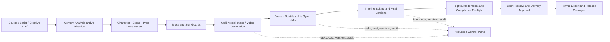
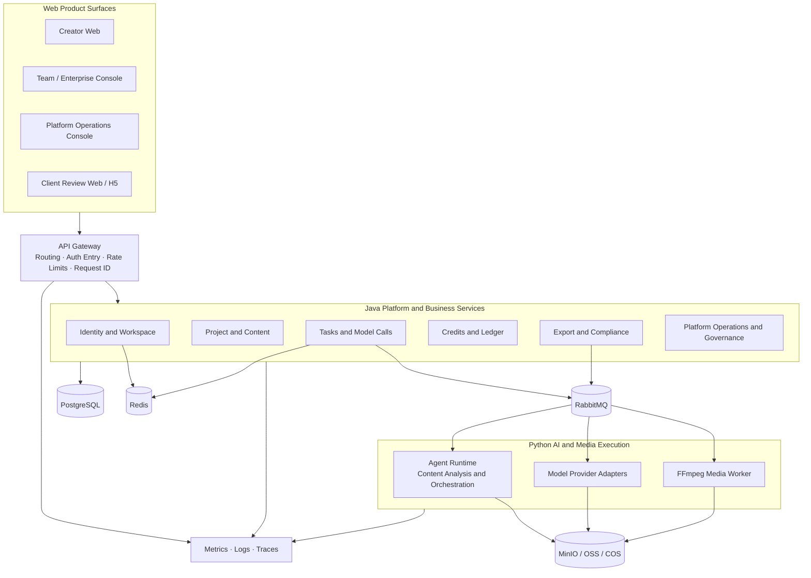

# Xingjing Drama Studio

<p align="center">
  A Web production operating system for Chinese AI short-drama and motion-comic teams
  <br>
  From content understanding, assets, and storyboards to multi-model generation, client review, cost governance, compliance evidence, and formal delivery
</p>

<p align="center">
  <a href="README.md">中文</a> ·
  <a href="README.en.md">English</a>
</p>

<p align="center">
  
  
  
  
  
  <a href="LICENSE"></a>
</p>

> [!IMPORTANT]
> Xingjing Drama Studio v9.2 is under active development. The “Core Capabilities” section describes the complete product baseline; it does not mean that every capability is released or accepted. Completion is determined by the [requirements and progress ledger](docs/project/requirements/01-需求总览与完成度.md) and its joint-acceptance evidence.

## Project Overview

Xingjing Drama Studio is a collaborative production platform for AI short dramas, motion comics, and commercial video teams. It keeps scripts, characters, scenes, props, shots, model tasks, media results, versions, costs, rights, and delivery evidence in one project context, reducing fragmentation across creative tools, model portals, spreadsheets, and chat threads.

The platform does not assume that one model can replace an entire production team, and it is not intended to replace a professional nonlinear editor in full. It focuses on three problems:

- **Production continuity:** preserve traceable references from source material and scripts through assets, shots, generated media, and final-video versions.
- **Team control:** move long-running tasks, permissions, costs, client feedback, and delivery state out of personal devices and chat history.
- **Commercial delivery:** make rights, moderation, AIGC labeling, formal export, and audit evidence part of the production workflow.

### Who it is for

- Studios producing AI short dramas, motion comics, or narrative video at scale;
- Producers, directors, storyboard artists, and visual teams that need consistent character, scene, and prop assets;
- AI content teams using multiple text, image, video, and audio providers;
- Organizations that need member roles, seats, cost controls, client review, and delivery workflows;
- SaaS operators that need platform-level model, moderation, finance, operations, and audit controls.

## Product Scope

The product baseline covers four cooperating Web surfaces with 197 business pages:

| Surface | Primary users | Responsibility | Pages |
|---|---|---|---:|
| **Creator Web** | Producers, writers, directors, storyboard artists, visual/video/audio editors, operations, and legal staff | End-to-end production from content intake to final delivery | 124 |
| **Team / Enterprise Console** | Owners, team administrators, finance staff, and project leads | Members, roles, permissions, seats, costs, and organization settings | 18 |
| **Platform Operations Console** | Operations, moderation, finance, support, model operations, SRE, and super administrators | User, project, model, compute-credit, compliance, finance, and service governance | 50 |
| **Client Review Web / H5** | Clients, commissioning parties, and external reviewers | Secure access, playback, annotations, version review, and delivery confirmation | 5 |

Native Windows, macOS, iOS, Android, and HarmonyOS clients are outside the initial v9.2 scope. Platform API, identity, upload, task, notification, and version contracts are designed to preserve consistent boundaries for future clients.

## End-to-End Production Flow



Every shot has a stable ID. Shots reference reusable subject assets and generation results, and reordering does not change identity. Long-running jobs remain governed by server-side state after a page closes. A formal export must be tied to an immutable project version, a compliance decision, and an audit record.

## Core Capabilities

| Domain | Main capabilities |
|---|---|
| **Content Understanding and AI Direction** | Novel, screenplay, and document intake; structured extraction; content health checks; character and narrative analysis; episode planning; AI rewriting and directing settings |
| **Subject and Media Assets** | Character, scene, prop, wardrobe, voice, and media libraries; multi-image references; versioning; rights and provenance; cross-shot references and impact analysis |
| **Shots and Storyboards** | Shot breakdown, batch editing, quality checks, import/export, version comparison, storyboard orchestration, and timeline preview |
| **Multi-Model Media Generation** | Text, image, video, reference-to-video, first/last-frame video, extension, inpainting, reference fusion, upscaling, restoration, and candidate comparison through a unified provider catalog |
| **Audio and Subtitles** | Voiceover, voices, subtitle timelines, BGM, sound effects, mixing, lip sync, deterministic fallback, and version comparison |
| **Editing and Final Video** | Lightweight timeline editing, clip replacement, preview, version history, final composition, and delivery formats for CapCut/Jianying, Premiere, and DaVinci |
| **Tasks and Real-Time State** | Asynchronous tasks, idempotent submission, concurrency and leases, cancel/retry, callback deduplication, failure compensation, SSE progress, and notifications |
| **Team Collaboration and Review** | Workspaces, multitenancy, project members, role permissions, seats, activity logs, client links, frame-level comments, approvals, and delivery confirmation |
| **Compute Credits, Cost, and Finance** | Preflight estimates, credit holds, success settlement, failure release, ledger invariants, team costs, orders, refunds, invoices, and reconciliation |
| **Compliance, Rights, and Release** | IP and likeness rights, sensitive-content checks, AIGC labels, appeals, formal-export gates, release packages, and evidence retention |
| **Templates, Community, and Commerce** | Template and asset markets, community, Fork lineage and rights, commercial jobs, acceptance, revenue rules, open APIs, and enterprise delivery |
| **Platform Operations and Governance** | User and project governance, model and pricing catalogs, moderation, compute credits and finance, support, messaging, operations settings, monitoring, alerts, and audit |

### Business invariants

1. Every shot has a stable unique ID; reordering never changes shot identity.
2. Subject assets are referenced by shots by default, and asset changes must expose their impact.
3. One idempotency key cannot create duplicate paid jobs or duplicate charges.
4. Generation settles only after success; explicit failure or cancellation releases unused held credits.
5. Model request evidence, response summaries, provider job IDs, costs, and outputs remain traceable.
6. A client review link never grants production-editing access.
7. Workspace data is protected by server-side tenant and object-ownership checks.
8. A formal-export compliance gate cannot be bypassed by hiding UI or calling an internal endpoint directly.
9. Billing, audit, model-call, and compliance evidence cannot be physically deleted by ordinary users.

## Delivery Phases and Current Status

| Phase | Scope | Delivery outcome | Current status |
|---|---:|---|---|
| **P0: Production Closure** | 56 pages | Identity and workspace, projects, scripts, assets, shots, generation, audio/subtitles, final video, basic billing, compliance, and formal MP4 export | In development |
| **P1: Studio-Scale Delivery** | 121 pages | Team collaboration, fine-grained permissions, professional production enhancements, client review, complete rights evidence, release packages, cost/finance, and operational support | In development |
| **P2: Ecosystem and Enterprise Expansion** | 20 pages | Templates, markets, community, Fork, commercial jobs, open APIs, private deployment, and data feedback | In development |

The current ledger marks all 19 business modules and the shared platform foundation as in development. The repository already contains substantial runnable code, tests, and compatibility capabilities, but a feature becomes “verified” only after requirements mapping, automated tests, migration checks, runtime evidence, and its joint-acceptance package are complete.

For current status, see:

- [Requirements project and phase snapshot](docs/project/XINGJING_REQUIREMENTS_PROJECT.md)
- [Completion ledger for all 19 modules](docs/project/requirements/01-需求总览与完成度.md)
- [Dependencies and joint acceptance](docs/project/requirements/06-依赖关系与联合验收.md)
- [Acceptance and test evidence](docs/project/requirements/04-验收与测试证据.md)
- [Changes and gaps](docs/project/requirements/05-变更与缺口清单.md)

## System Architecture

### v9.2 target architecture



The target boundary is “Java owns business truth; Python owns AI orchestration and provider execution.” Long-running work uses transactional outbox records, messaging, and idempotent consumers for eventual consistency. Media binaries go to object storage; databases retain metadata, digests, ownership, and version references.

### Current repository shape

The repository is evolving from a single AI video workspace into the Xingjing platform, so the current implementation is intentionally hybrid:

- `frontend/`: React SPA containing the creator workspace and progressively integrated identity, team, review, generation, compliance, platform-admin, and ecosystem pages.
- `platform-services/`: Java 21 and Spring Boot platform foundation, currently covering identity, sessions, workspaces, and database migrations.
- `server/xingjing_*`: domain-oriented Xingjing Python services, runtimes, HTTP routers, and persistence adapters.
- `server/agent_runtime/`: Claude Agent SDK sessions, tools, skills, and streaming-event runtime.
- `lib/`: established project management, media generation, provider adapters, task queue, cost tracking, and data validation.
- `alembic/` and Flyway: versioned migrations for Python domain data and Java platform data.

Existing Python/React generation functionality is built on an ArcReel compatibility foundation. New Xingjing modules must pass v9.2 contracts and joint acceptance before compatibility functionality is treated as a verified Xingjing product capability.

### Generation task data flow

1. A Web request passes identity, workspace, and object-ownership checks before an idempotent task is created.
2. The task service estimates cost, requests a credit hold, and persists the task with its outbox event.
3. A worker invokes a model or media processor and writes outputs to controlled storage.
4. Callbacks and event consumers deduplicate by event ID and provider job ID.
5. Successful jobs settle actual cost; failed, cancelled, or unexecuted portions release held credits.
6. SSE accelerates UI refresh, while persisted task state remains the recovery and decision authority.
7. Formal export rechecks project version, asset completeness, rights, compliance, and billing state.

## Technology Stack

| Layer | Current technology |
|---|---|
| **Web Frontend** | React 19, TypeScript 6, Tailwind CSS 4, Vite 8, wouter, zustand, Framer Motion, i18next, Vitest |
| **Platform Services** | Java 21, Spring Boot, Spring Security, Spring Data JPA, Flyway, Gradle |
| **AI and Business Backend** | Python 3.12+, FastAPI, Pydantic 2, SQLAlchemy 2 Async, Alembic, Claude Agent SDK |
| **Model Integration** | Unified text, image, video, and audio backend contracts with built-in providers and OpenAI/Google-compatible custom providers |
| **Async and Real Time** | Generation queue, leases and concurrency control, SSE; target platform uses RabbitMQ and transactional outbox |
| **Data** | PostgreSQL for the platform target and production, SQLite for compatibility development, Redis for target cache/session workloads |
| **Media and Storage** | FFmpeg, Pillow, local compatibility storage, MinIO/OSS/COS target object storage |
| **Quality** | pytest, Ruff, BasedPyright, Vitest, ESLint, Spring Test, Testcontainers |
| **Delivery** | Docker Compose and containerized production, with boundaries preserved for later Kubernetes evolution |

Provider models, durations, reference-image limits, resolutions, and defaults are sourced from `PROVIDER_REGISTRY` in `lib/config/registry.py`. This README intentionally does not duplicate a model list that changes frequently.

## Repository Layout

```text
xingjing/
├── frontend/                  React Web product surfaces
├── platform-services/         Java / Spring Boot platform foundation
├── server/                    FastAPI, Xingjing domain runtimes, and HTTP APIs
│   └── agent_runtime/         Claude Agent SDK sessions and tool runtime
├── lib/                       AI video production core and provider adapters
├── agent_runtime_profile/     Embedded agent skills, subagents, and system prompts
├── alembic/                   Python database migrations
├── infra/compose/             PostgreSQL, RabbitMQ, and MinIO development dependencies
├── deploy/                    Docker Compose for the compatibility runtime
├── docs/product/v9.2/         Product, architecture, data, API, security, and acceptance baseline
├── docs/project/requirements/ Requirements, status, evidence, and joint-acceptance ledger
├── tests/                     Python unit, integration, and contract tests
└── scripts/                   Baseline, ledger, verification, and migration tools
```

## Quick Start

### Prerequisites

- Python 3.12+
- Node.js 20.19+ and pnpm 10+
- uv
- FFmpeg
- Java 21 when running platform services
- Docker Desktop or Docker Engine for PostgreSQL, RabbitMQ, MinIO, and container-based tests

Linux, macOS, WSL2, or Docker is recommended. Native Windows supports project creation and basic flows, but the Agent bwrap sandbox falls back to a restricted command allowlist.

### 1. Clone and install dependencies

```bash
git clone https://github.com/mmt1202/xingjing.git
cd xingjing

cp .env.example .env
uv sync

cd frontend
pnpm install
cd ..
```

On PowerShell, use `Copy-Item .env.example .env` instead of `cp`.

### 2. Initialize the compatibility development database

```bash
uv run alembic upgrade head
```

The default compatibility development mode uses SQLite. Xingjing platform domains such as multitenancy, billing, client review, and compliance require their corresponding PostgreSQL URLs. See [`.env.example`](.env.example) for variables and fail-closed behavior.

### 3. Start the FastAPI backend

```bash
uv run uvicorn server.app:app --reload --reload-dir server --reload-dir lib --port 1241
```

Keep the `--reload-dir` limits. Without them, the file watcher scans large trees such as `node_modules`, `.venv`, and `.git`.

### 4. Start the React frontend

In another terminal:

```bash
cd frontend
pnpm dev
```

Open `http://localhost:5173`. Vite proxies `/api` to `http://127.0.0.1:1241`.

### 5. Start platform infrastructure and the Java service (optional)

Start PostgreSQL, RabbitMQ, and MinIO:

```powershell
Copy-Item infra/compose/.env.example infra/compose/.env
docker compose --env-file infra/compose/.env -f infra/compose/dev.compose.yml up -d
```

Then start the Spring Boot platform service:

```powershell
$env:DATABASE_URL = "jdbc:postgresql://127.0.0.1:15432/xingjing"
$env:DATABASE_USER = "xingjing"
$env:DATABASE_PASSWORD = "xingjing-local"
.\gradlew.bat :platform-services:platform-app:bootRun
```

The platform service listens on `http://localhost:8080` by default. On POSIX, use `./gradlew` and provide the same database environment variables.

### Configuration notes

- Identity, database, Agent, logging, and Xingjing domain runtime variables are documented in [`.env.example`](.env.example).
- Model API keys, default backends, and project-level model selection are managed through the Web settings page.
- FFmpeg and ffprobe must be discoverable on `PATH` before media composition, probing, or professional-format export.
- Production configuration requires independent strong secrets, PostgreSQL, controlled object storage, and explicit callback signatures for providers.

## Testing and Quality Gates

### Python

```bash
uv run python -m pytest
uv run ruff check .
uv run ruff format --check .
uv run basedpyright
```

### Frontend

```bash
cd frontend
pnpm lint
pnpm check
pnpm build
```

### Java platform

```powershell
.\gradlew.bat test
```

Use `./gradlew test` on POSIX. Some integration tests start PostgreSQL through Testcontainers and require a working Docker environment.

### Product baseline and requirements ledger

```powershell
.\scripts\Test-RequirementsLedger.ps1
.\scripts\Test-ProductBaseline.ps1
```

Before committing, run the lint, type-check, test, and build gates relevant to the change. A capability reaches “verified” only when its requirements, implementation, migrations, automated tests, runtime evidence, and release gates all pass.

## Deployment Status

The Compose files under `deploy/` still serve the compatibility runtime; they do not mean that the complete four-surface v9.2 production topology has been delivered. Full-platform production release still requires verified PostgreSQL, object storage, messaging, providers, billing, compliance, monitoring, backup/recovery, and external commercial gates.

See [`docs/deployment.md`](docs/deployment.md) for deployment and sandbox notes. Do not treat the compatibility Compose configuration as a one-command production deployment of the complete Xingjing platform without checking the current ledger and production variables.

## Documentation

### Product and requirements

- [v9.2 development specification package](docs/product/v9.2/README.md)
- [Governance and source of truth](docs/product/v9.2/00-governance/source-of-truth.md)
- [Product scope and priorities](docs/product/v9.2/01-product/scope-and-priority.md)
- [Information architecture](docs/product/v9.2/01-product/information-architecture.md)
- [Page-level requirements index](docs/project/requirements/02-逐页需求查询索引.md)

### Architecture and engineering

- [System and service architecture](docs/product/v9.2/04-architecture/system-architecture.md)
- [Data dictionary](docs/product/v9.2/05-data/data-dictionary.md)
- [API conventions](docs/product/v9.2/06-api/api-conventions.md)
- [Event contracts](docs/product/v9.2/07-workflows/event-contracts.md)
- [State machines](docs/product/v9.2/07-workflows/state-machines.md)
- [AI model integration](docs/product/v9.2/08-ai/model-integration.md)
- [Compute-credit billing](docs/product/v9.2/09-billing/credit-billing.md)
- [Security and compliance](docs/product/v9.2/10-security/compliance-and-security.md)
- [Development and deployment](docs/product/v9.2/12-devops/development-and-deployment.md)

### Development collaboration

- [Contributing guide](CONTRIBUTING.md)
- [Getting started guide](docs/getting-started.md)
- [Known issues](docs/known-issues.md)
- [Domain documentation conventions](docs/agents/domain.md)
- [Issue tracking conventions](docs/agents/issue-tracker.md)

## Contributing

Issues and pull requests are welcome. Read the [contributing guide](CONTRIBUTING.md) before development, and follow the repository's Conventional Commits, three-language i18n, database migration, Windows compatibility, and test-evidence requirements.

Changes that affect pages, fields, APIs, states, permissions, billing, compliance, or acceptance scope must also update the corresponding v9.2 specifications and requirements ledger.

## License and Upstream Attribution

This repository is distributed under the [GNU Affero General Public License v3.0](LICENSE) and the additional terms in [`NOTICE`](NOTICE).

Xingjing Drama Studio includes portions modified and extended from ArcReel open-source code. The following statement is retained as required by `NOTICE`:

**Powered by ArcReel — https://github.com/ArcReel/ArcReel**

The Xingjing product design, platform modules, requirements package, and other modifications are maintained by this repository's contributors. The ArcReel name or logo must not be used to imply upstream endorsement of these changes.
