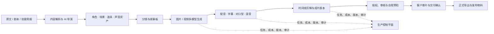
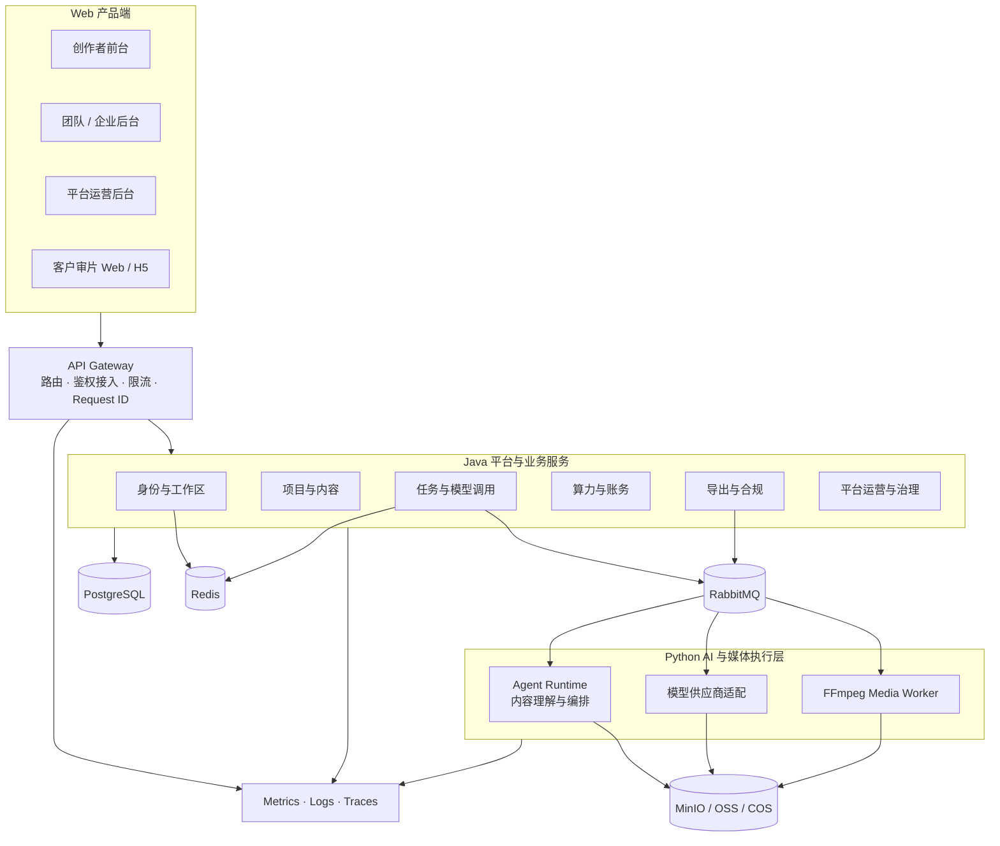

# 星镜剧创（Xingjing Drama Studio）

<p align="center">
  面向中国 AI 短剧与漫剧团队的 Web 生产操作系统
  <br>
  从内容理解、资产与分镜生产，到多模型生成、协作审片、成本治理、合规留痕和正式交付
</p>

<p align="center">
  <a href="README.md">中文</a> ·
  <a href="README.en.md">English</a>
</p>

<p align="center">
  
  
  
  
  
  <a href="LICENSE"></a>
</p>

> [!IMPORTANT]
> 星镜剧创 v9.2 正在持续开发。本文的“核心能力”描述完整产品基线，不代表所有功能均已上线或通过验收。功能是否完成，以[需求与进度台账](docs/project/requirements/01-需求总览与完成度.md)及其联合验收证据为准。

## 项目概述

星镜剧创是面向 AI 短剧、漫剧和商业视频团队的协同生产平台。它把剧本、角色、场景、道具、镜头、模型任务、音视频结果、版本、成本、授权与交付证据组织在同一个项目上下文中，减少创作工具、模型平台、表格和即时通讯之间的割裂。

平台不试图用单一模型替代完整制作团队，也不把自己定位成专业非线性剪辑软件的完整替代品。它重点解决三类问题：

- **生产连续性**：让原文、剧本、资产、分镜、生成结果和成片版本之间保持可追踪引用。
- **团队可控性**：让长任务、权限、成本、客户反馈和交付状态脱离个人设备与聊天记录。
- **商业可交付性**：让授权、审核、AIGC 标识、正式导出和审计证据成为生产流程的一部分。

### 适合谁

- 需要批量制作短剧、漫剧或剧情短视频的创作团队；
- 需要统一角色、场景和道具资产的制片、导演、分镜与视觉团队；
- 同时使用多家文本、图像、视频和音频模型的 AI 内容工作室；
- 需要成员权限、席位、成本、审片和交付流程的企业团队；
- 需要平台级模型、审核、财务、运营和审计能力的 SaaS 运营方。

## 产品范围

产品基线覆盖 4 个相互协作的 Web 端，共 197 个业务页面：

| 产品端 | 主要用户 | 核心职责 | 页面数 |
|---|---|---|---:|
| **创作者前台** | 制片、编剧、导演、分镜、视觉、视频、音频、剪辑、运营、法务 | 从内容导入到成片交付的完整生产工作台 | 124 |
| **团队/企业后台** | 所有者、团队管理员、财务、项目负责人 | 成员、角色、权限、席位、成本和企业配置 | 18 |
| **平台运营后台** | 运营、审核、财务、客服、模型运营、运维、超级管理员 | 用户、项目、模型、算力、合规、财务和服务治理 | 50 |
| **客户审片 Web/H5** | 客户、甲方、外部审核者 | 安全访问、播放批注、版本审阅和交付确认 | 5 |

原生 Windows、macOS、iOS、Android 和 HarmonyOS 客户端不属于 v9.2 首期范围；平台 API、身份、上传、任务、通知和版本契约会为后续客户端保留一致边界。

## 端到端生产流程



工作流中的每个镜头拥有稳定 ID；镜头引用主体资产和生成结果，重排不会改变身份。长任务关闭页面后仍以服务端状态为准，正式导出必须绑定不可变项目版本、合规结论和审计记录。

## 核心能力

| 能力域 | 主要能力 |
|---|---|
| **内容理解与 AI 导演** | 小说、剧本和多种文档导入；结构化解析；内容体检；角色与剧情理解；剧集规划；AI 改写与导演设定 |
| **主体与素材资产** | 角色、场景、道具、服装、声音和素材库；多图参考；版本管理；授权与来源记录；跨镜头引用和影响分析 |
| **分镜与故事板** | 镜头拆分、批量编辑、质量检测、导入导出、版本对比、故事板编排和时间轴预览 |
| **多模型媒体生成** | 文本、图片、视频、参考生视频、首尾帧、延展、局部重绘、融合、放大、修复和候选对比；统一供应商适配与能力目录 |
| **音频与字幕** | 配音、音色、字幕时间轴、BGM、音效、混音、对口型、失败回退和版本对比 |
| **剪辑与成片** | 轻量时间线、片段替换、成片预览、版本记录、最终合成以及剪映、Premiere、DaVinci 等交付格式 |
| **任务与实时状态** | 异步任务、幂等提交、并发与租约、取消重试、回调去重、失败补偿、SSE 进度和通知 |
| **团队协作与审片** | 工作区、多租户、项目成员、角色权限、席位、操作日志、客户外链、帧级批注、审批和交付确认 |
| **算力、成本与财务** | 生成前预估、算力冻结、成功结算、失败释放、流水守恒、团队成本、订单、退款、发票和对账 |
| **合规、版权与发布** | IP 与真人形象授权、敏感内容检测、AIGC 标识、风险申诉、正式导出门禁、发布包和证据留存 |
| **模板、社区与商业生态** | 模板与资产市场、社区、Fork 谱系与授权、商单、验收、收益规则、开放 API 和企业交付 |
| **平台运营与治理** | 用户和项目治理、模型与价格目录、审核、算力与财务、客服、消息、运营配置、监控、告警和审计 |

### 关键业务约束

1. 每个镜头使用稳定唯一 ID；排序变化不改变镜头身份。
2. 主体资产默认以引用方式进入镜头，资产变化必须显示影响范围。
3. 同一幂等键不能重复创建付费任务或重复扣费。
4. 生成任务成功后才结算；明确失败或取消必须释放未消耗冻结额。
5. 模型原始请求、响应摘要、供应商任务 ID、成本和结果必须可追踪。
6. 客户审片外链不能获得项目生产编辑权限。
7. 工作区业务数据必须执行服务端租户和对象归属校验。
8. 正式导出合规门禁不能通过隐藏按钮或直接调用内部接口绕过。
9. 账务、审计、模型调用和合规证据不能由普通用户物理删除。

## 交付阶段与当前状态

| 阶段 | 范围 | 交付目标 | 当前口径 |
|---|---:|---|---|
| **P0：生产闭环** | 56 页 | 账号与工作区、项目、剧本、资产、分镜、生成、音频字幕、成片、基础计费、合规和正式 MP4 导出 | 开发中 |
| **P1：工作室规模化** | 121 页 | 团队协作、细粒度权限、专业生产增强、客户审片、完整授权、发布包、成本财务和运营支撑 | 开发中 |
| **P2：生态与企业扩张** | 20 页 | 模板、市场、社区、Fork、商单、开放 API、私有化和数据回流 | 开发中 |

当前需求台账将 19 个业务模块及共享平台地基均标记为“开发中”。仓库中已经存在大量可运行代码、测试和兼容能力，但只有完成需求映射、自动化测试、迁移验证、运行证据及对应联合验收包后，功能才会标记为“已验证”。

详细状态请查看：

- [全需求项目与阶段快照](docs/project/XINGJING_REQUIREMENTS_PROJECT.md)
- [19 个模块的完成度台账](docs/project/requirements/01-需求总览与完成度.md)
- [依赖关系与联合验收](docs/project/requirements/06-依赖关系与联合验收.md)
- [验收与测试证据](docs/project/requirements/04-验收与测试证据.md)
- [变更与缺口清单](docs/project/requirements/05-变更与缺口清单.md)

## 系统架构

### v9.2 目标架构



目标架构遵循“Java 持有业务真相，Python 负责 AI 编排与供应商执行”的边界。长任务通过事务出站表、消息队列和幂等消费者实现最终一致；媒体二进制进入对象存储，数据库只保存元数据、摘要、归属和版本引用。

### 当前仓库形态

仓库正在从单体 AI 视频工作台演进为星镜平台，因此当前实现是受控的混合形态：

- `frontend/`：React SPA，包含创作者工作台以及逐步接入的身份、团队、审片、生成、合规、平台后台和生态页面。
- `platform-services/`：Java 21 + Spring Boot 平台地基，当前承载身份、会话、工作区和数据库迁移等能力。
- `server/xingjing_*`：按领域拆分的星镜 Python 服务、运行时、HTTP 路由和持久化适配。
- `server/agent_runtime/`：基于 Claude Agent SDK 的会话、工具、Skill 和流式事件运行时。
- `lib/`：成熟的项目管理、媒体生成、供应商适配、任务队列、费用跟踪和数据校验核心库。
- `alembic/` 与 Flyway：分别维护 Python 领域数据和 Java 平台数据的版本化迁移。

现有 Python/React 生成能力来自 ArcReel 兼容基础。星镜新增模块必须通过 v9.2 契约和联合验收后，才会从“兼容能力”升级为星镜的已验证产品能力。

### 生成任务数据流

1. Web 请求经身份、工作区和对象归属校验后创建幂等任务。
2. 任务服务估算成本并请求冻结算力，再持久化任务和出站事件。
3. Worker 调用模型或媒体处理器，将结果写入受控存储。
4. 回调与事件消费者按事件 ID 和供应商任务 ID 去重。
5. 成功任务结算实际成本；失败、取消或未执行部分释放冻结额。
6. SSE 加速前端刷新，持久化任务状态始终是恢复和裁决依据。
7. 正式导出再次检查项目版本、资产完整性、授权、合规和账务状态。

## 技术栈

| 层级 | 当前技术 |
|---|---|
| **Web 前端** | React 19、TypeScript 6、Tailwind CSS 4、Vite 8、wouter、zustand、Framer Motion、i18next、Vitest |
| **平台服务** | Java 21、Spring Boot、Spring Security、Spring Data JPA、Flyway、Gradle |
| **AI 与业务后端** | Python 3.12+、FastAPI、Pydantic 2、SQLAlchemy 2 Async、Alembic、Claude Agent SDK |
| **模型适配** | 统一文本、图像、视频与音频后端协议；支持内置供应商及 OpenAI/Google 兼容自定义供应商 |
| **异步与实时** | 生成队列、租约和并发控制、SSE；目标平台使用 RabbitMQ 与事务出站模式 |
| **数据** | PostgreSQL（平台目标与生产）、SQLite（兼容开发模式）、Redis（目标缓存与会话） |
| **媒体与存储** | FFmpeg、Pillow、本地兼容存储、MinIO/OSS/COS 目标对象存储 |
| **质量保障** | pytest、Ruff、BasedPyright、Vitest、ESLint、Spring Test、Testcontainers |
| **交付** | Docker Compose；容器化生产，保留向 Kubernetes 演进的边界 |

供应商模型、时长、参考图上限、分辨率和默认值以 `lib/config/registry.py` 中的 `PROVIDER_REGISTRY` 为准，README 不复制易漂移的模型清单。

## 仓库结构

```text
xingjing/
├── frontend/                 React Web 产品端
├── platform-services/        Java / Spring Boot 平台地基
├── server/                   FastAPI、星镜领域运行时与 HTTP API
│   └── agent_runtime/        Claude Agent SDK 会话与工具运行时
├── lib/                      AI 视频生产核心库与供应商适配
├── agent_runtime_profile/    内嵌智能体的 Skill、Subagent 与系统提示词
├── alembic/                  Python 数据库迁移
├── infra/compose/            PostgreSQL、RabbitMQ、MinIO 开发依赖
├── deploy/                   兼容运行时的 Docker Compose 配置
├── docs/product/v9.2/        产品、架构、数据、API、安全与验收基线
├── docs/project/requirements/需求、状态、证据和联合验收台账
├── tests/                    Python 单元、集成与契约测试
└── scripts/                  基线、台账、验证和迁移脚本
```

## 快速开始

### 环境要求

- Python 3.12+
- Node.js 20.19+ 与 pnpm 10+
- uv
- FFmpeg
- Java 21（运行平台服务时需要）
- Docker Desktop 或 Docker Engine（运行 PostgreSQL、RabbitMQ、MinIO 及容器测试时需要）

推荐 Linux、macOS、WSL2 或 Docker。Windows 原生可以完成项目创建和基础流程，但 Agent 的 bwrap 沙箱会降级为受限命令白名单。

### 1. 获取代码并安装依赖

```bash
git clone https://github.com/mmt1202/xingjing.git
cd xingjing

cp .env.example .env
uv sync

cd frontend
pnpm install
cd ..
```

PowerShell 可使用 `Copy-Item .env.example .env` 代替 `cp`。

### 2. 初始化兼容开发数据库

```bash
uv run alembic upgrade head
```

默认兼容开发模式使用 SQLite。需要星镜多租户、账务、审片、合规等平台领域时，应配置对应的 PostgreSQL URL；各变量和拒绝式降级行为见 [`.env.example`](.env.example)。

### 3. 启动 FastAPI 后端

```bash
uv run uvicorn server.app:app --reload --reload-dir server --reload-dir lib --port 1241
```

必须限定 `--reload-dir`，否则文件监视器会扫描 `node_modules`、`.venv`、`.git` 等大型目录。

### 4. 启动 React 前端

在另一个终端运行：

```bash
cd frontend
pnpm dev
```

访问 `http://localhost:5173`。Vite 会把 `/api` 代理到 `http://127.0.0.1:1241`。

### 5. 启动平台基础设施与 Java 服务（可选）

先启动 PostgreSQL、RabbitMQ 和 MinIO：

```powershell
Copy-Item infra/compose/.env.example infra/compose/.env
docker compose --env-file infra/compose/.env -f infra/compose/dev.compose.yml up -d
```

再启动 Spring Boot 平台服务：

```powershell
$env:DATABASE_URL = "jdbc:postgresql://127.0.0.1:15432/xingjing"
$env:DATABASE_USER = "xingjing"
$env:DATABASE_PASSWORD = "xingjing-local"
.\gradlew.bat :platform-services:platform-app:bootRun
```

平台服务默认监听 `http://localhost:8080`。POSIX 环境使用 `./gradlew`，并以同名环境变量传入数据库配置。

### 配置说明

- 身份、数据库、Agent、日志和星镜领域运行时变量见 [`.env.example`](.env.example)。
- 模型 API Key、默认后端和项目级模型选择通过 Web 设置页管理。
- FFmpeg/ffprobe 在运行媒体合成、探测和专业格式导出前必须可被 `PATH` 找到。
- 生产配置必须使用独立强密钥、PostgreSQL、受控对象存储和明确的供应商回调签名。

## 测试与质量门禁

### Python

```bash
uv run python -m pytest
uv run ruff check .
uv run ruff format --check .
uv run basedpyright
```

### 前端

```bash
cd frontend
pnpm lint
pnpm check
pnpm build
```

### Java 平台

```powershell
.\gradlew.bat test
```

POSIX 环境使用 `./gradlew test`。部分集成测试通过 Testcontainers 启动 PostgreSQL，需要可用的 Docker 环境。

### 产品基线与需求台账

```powershell
.\scripts\Test-RequirementsLedger.ps1
.\scripts\Test-ProductBaseline.ps1
```

提交前至少保证与改动相关的 lint、类型检查、测试和构建通过。只有需求、实现、迁移、自动化测试、运行证据和发布门禁全部满足时，功能才能进入“已验证”状态。

## 部署状态

`deploy/` 下的 Compose 文件仍服务于兼容运行时，不代表 v9.2 四端平台的完整生产拓扑已经交付。完整平台的生产发布还需要完成 PostgreSQL、对象存储、消息队列、供应商、计费、合规、监控、备份恢复和外部商用门禁验证。

部署和沙箱补充说明见 [`docs/deployment.md`](docs/deployment.md)。不要在未核对当前需求台账和生产环境变量的情况下，把兼容 Compose 配置视为星镜完整平台的一键生产部署。

## 文档导航

### 产品与需求

- [v9.2 开发规格资料包](docs/product/v9.2/README.md)
- [资料治理与唯一事实源](docs/product/v9.2/00-governance/source-of-truth.md)
- [产品范围与优先级](docs/product/v9.2/01-product/scope-and-priority.md)
- [信息架构](docs/product/v9.2/01-product/information-architecture.md)
- [逐页需求查询索引](docs/project/requirements/02-逐页需求查询索引.md)

### 架构与工程

- [系统与服务架构](docs/product/v9.2/04-architecture/system-architecture.md)
- [数据字典](docs/product/v9.2/05-data/data-dictionary.md)
- [API 约定](docs/product/v9.2/06-api/api-conventions.md)
- [事件契约](docs/product/v9.2/07-workflows/event-contracts.md)
- [状态机](docs/product/v9.2/07-workflows/state-machines.md)
- [AI 模型接入](docs/product/v9.2/08-ai/model-integration.md)
- [算力计费](docs/product/v9.2/09-billing/credit-billing.md)
- [安全与合规](docs/product/v9.2/10-security/compliance-and-security.md)
- [开发与部署](docs/product/v9.2/12-devops/development-and-deployment.md)

### 开发协作

- [贡献指南](CONTRIBUTING.md)
- [完整入门教程](docs/getting-started.md)
- [已知问题](docs/known-issues.md)
- [领域文档规范](docs/agents/domain.md)
- [问题追踪规范](docs/agents/issue-tracker.md)

## 贡献

欢迎通过 Issue 和 Pull Request 参与星镜剧创。开始开发前请阅读[贡献指南](CONTRIBUTING.md)，并遵循 Conventional Commits、三语 i18n、数据库迁移、Windows 兼容和测试证据要求。

如果改动影响页面、字段、接口、状态、权限、计费、合规或验收范围，还必须同步对应的 v9.2 规格和需求台账。

## 许可证与上游署名

本仓库依据 [GNU Affero General Public License v3.0](LICENSE) 发布，并受 [`NOTICE`](NOTICE) 中附加条款约束。

星镜剧创包含在 ArcReel 开源代码基础上修改和扩展的部分。按照 `NOTICE` 的署名要求，保留以下声明：

**Powered by ArcReel — https://github.com/ArcReel/ArcReel**

星镜剧创的新增产品设计、平台模块、需求资料和其他修改由本仓库维护者负责；不得使用 ArcReel 名称或标识暗示上游项目为这些修改背书。
