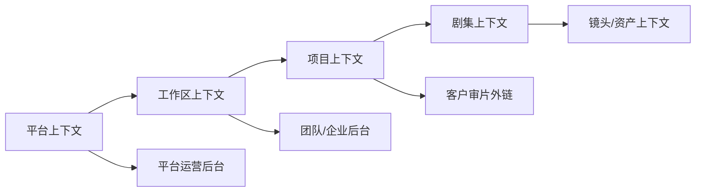

# v9.2 信息架构与导航规格

## 1. 上下文层级



- 平台上下文：账号、工作区选择、全局任务和平台级市场入口。
- 工作区上下文：项目库、全局资产、账单、团队和数据。
- 项目上下文：剧本到交付的生产流程；“当前项目”是动态上下文，不是平台固定菜单。
- 客户外链上下文：由项目版本派生，只暴露审片所需数据。
- 平台后台上下文：独立员工身份、独立权限与审计域。

## 2. 创作者前台一级导航

按 v9.2 固定为：

1. 创作首页
2. 项目库
3. 新建项目
4. 全局资产库
5. 模板与分支
6. 任务中心
7. 算力账单
8. 商单中心
9. 团队空间
10. 数据看板
11. 设置

剧本、AI 导演、主体资产、分镜、故事板、生成、音频、剪辑、审片、导出和合规属于项目内模块，只能从项目页面、任务关联、卡片、Tab、按钮或深链接进入。

## 3. 项目内阶段导航

标准顺序：

```text
项目总控 → 剧本 → 内容体检 → AI导演 → 主体资产 → 分镜 → 故事板
→ 图片/视频生成 → 音频字幕/对口型 → 成片剪辑 → 审片 → 导出发布 → 合规与归档
```

规则：

- 阶段可按项目模板隐藏，但不能改变底层数据依赖。
- 未完成强前置条件的阶段显示原因和处理入口，不能只置灰。
- 用户可通过任务、搜索和通知深链接进入具体对象；面包屑必须恢复工作区、项目、剧集和对象上下文。
- 项目切换时清除仅属于上一项目的筛选、选中对象和批量操作状态。

## 4. 团队/企业后台一级导航

1. 团队总览
2. 成员管理
3. 角色权限
4. 权限矩阵
5. 席位管理
6. 团队账单
7. 算力流水
8. 项目成本
9. 客户审片
10. 企业配置

邀请记录、操作日志、成员人效、套餐详情、项目成本明细和外链管理作为对应一级模块的二级页面进入。

## 5. 平台运营后台一级导航

1. 后台首页
2. 用户管理
3. 团队管理
4. 项目管理
5. 内容管理
6. 生成任务
7. 模型管理
8. 审核合规
9. 订单财务
10. 套餐权益
11. 模板商单
12. 客服支持
13. 运营配置
14. 系统运维
15. 开放 API

后台员工、角色权限、审计日志、敏感操作、登录日志和系统配置由系统运维/安全入口进入，不在一级菜单重复铺开。

## 6. 客户审片导航

客户审片不展示平台侧栏，流程固定为：

```text
访问验证 → 审片首页 → 播放审片 → 时间点批注 → 确认交付或打回
```

外链过期、被撤销、密码错误次数超限或版本不可见时进入独立错误态，不跳转创作者登录页。

## 7. 全局入口

- 搜索：按权限搜索项目、剧集、镜头、资产和任务；后台搜索不与创作者数据范围混用。
- 通知：任务、评论、审批、计费和安全事件，点击必须定位到具体上下文。
- 任务中心：显示跨项目长任务，但进入详情后恢复项目上下文。
- 用户菜单：工作区切换、账号安全、登录设备和退出。

## 8. URL 与返回规则

- 生产实现使用语义路由，静态 HTML 文件名仅作为 v9.2 页面基线标识。
- 所有对象详情路由包含对象 ID；工作区和项目上下文由路径或服务端会话明确提供，禁止仅依赖浏览器本地状态。
- 列表进入详情后返回，应恢复分页、筛选、排序和滚动位置。
- 无权限、对象不存在、对象已删除分别返回 403、404、410 语义页面。
