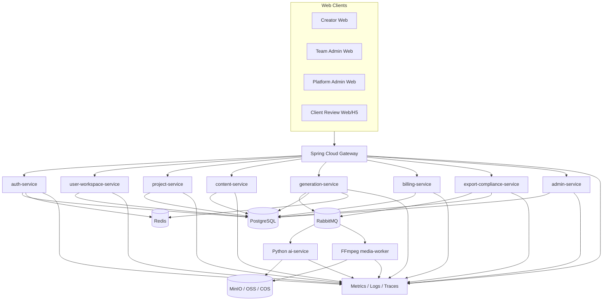
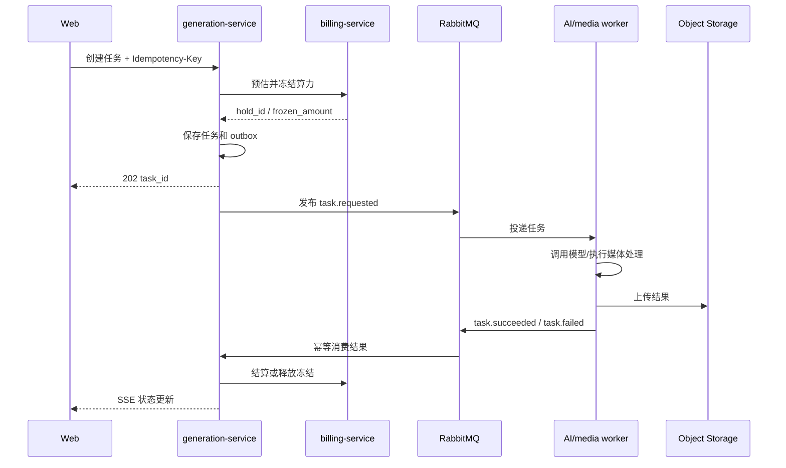
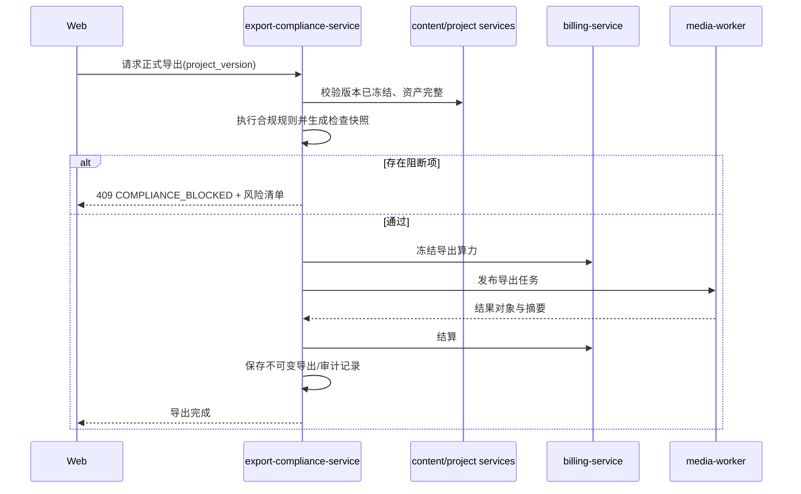

# v9.2 系统与服务架构

## 1. 架构目标

系统首先保证长任务可追踪、账务可守恒、数据可隔离、生成可替换、导出可审计。首期使用有限服务数量和清晰模块边界，避免为了形式拆成大量微服务。

## 2. 总体架构



## 3. 服务职责

| 服务 | 持有的业务真相 | 不负责 |
|---|---|---|
| gateway | 路由、统一鉴权接入、限流、请求 ID | 业务权限裁决、数据写入 |
| auth-service | 账号、凭证、会话、验证码、安全事件 | 工作区业务权限 |
| user-workspace-service | 工作区、成员、角色、席位、工作区权限 | 项目内容、平台后台员工 |
| project-service | 项目、剧集、成员、状态、预算上限 | 剧本内容、模型调用 |
| content-service | 剧本、导演设定、资产、分镜、故事板、版本 | 长任务执行、扣费 |
| generation-service | 生成任务、模型定义引用、模型调用记录、生成结果元数据 | 账户余额真相、供应商密钥展示 |
| billing-service | 算力账户、冻结、流水、订单、退款和对账 | 决定生成内容质量 |
| export-compliance-service | 时间线/成片引用、导出任务、发布包、合规与授权记录 | 原始媒体二进制存储 |
| admin-service | 后台员工、后台角色、运营配置、工单、后台聚合查询 | 绕过业务服务直接改业务库 |
| Python ai-service | 自研能力、第三方适配、结构化 AI 输出 | 用户权限、项目权限、最终账务 |
| media-worker | 转码、拼接、字幕、音频混合、缩略图 | 业务状态裁决 |

P1/P2 的模板、Fork、商单、市场、消息等能力首期作为上述服务内的独立模块；达到独立扩容或团队所有权需求后再拆服务。

## 4. 数据所有权

- 每张业务表只有一个写入服务所有者。
- 其他服务通过 API 或事件获得数据；禁止跨服务直接更新表。
- 首期可共用一个 PostgreSQL 实例，但按 schema 隔离：`auth`、`workspace`、`project`、`content`、`generation`、`billing`、`delivery`、`admin`。
- 读模型可由 admin-service 聚合或通过事件构建，不允许后台直接联表修改业务数据。
- 媒体二进制写入对象存储，数据库保存对象键、摘要、MIME、尺寸、时长、所有者和生命周期状态。

## 5. 同步调用

- Web API：HTTPS JSON，经 gateway 进入业务服务。
- Java 到 AI 的短任务：内部 HTTPS/REST，设置严格超时和请求 ID。
- 服务间读取：优先 API；同一服务内部模块使用本地调用。
- 所有写接口接受 `Idempotency-Key`；更新接口接受 `If-Match` 或版本字段。
- 链路传播 `X-Request-Id`、`traceparent`、用户 ID、工作区 ID；日志中不记录 token、密钥和签名 URL。

## 6. 异步调用

长任务流程：



关键约束：

- 数据库业务提交与事件发布使用事务出站表。
- 消费者使用 `event_id` 幂等；重复事件返回成功但不重复执行业务副作用。
- 供应商回调只更新模型调用尝试，不能直接修改余额或最终项目状态。
- 用户取消是请求，不保证已被供应商接受；最终费用由实际执行证据决定。

## 7. 正式导出流程



合规发生在正式导出之前。预览渲染可以带明显预览水印，不视为正式导出。

## 8. 一致性与事务

- 服务内强一致：单数据库事务。
- 服务间最终一致：outbox + 事件 + 幂等消费者。
- 计费失败时生成任务不能进入可交付成功态；进入 `settlement_pending` 并由补偿任务处理。
- 对象存储上传采用“临时对象 → 校验摘要 → 绑定业务对象 → 转正式对象”流程。
- 删除业务对象前检查引用；媒体删除采用延迟回收，不能立即破坏历史版本和审计证据。

## 9. 缓存

- Redis 只存会话、验证码、短期锁、限流计数、SSE 游标和可重建缓存。
- 余额、任务最终状态、权限和合规结论不得只存在 Redis。
- 缓存键包含环境和租户；权限变更主动失效相关缓存。
- 分布式锁只保护短临界区，不作为数据库唯一约束替代品。

## 10. 文件与媒体

对象键结构：

```text
workspaces/{workspace_id}/projects/{project_id}/
  source/{asset_id}/{version_id}/...
  shots/{shot_id}/images/{result_id}/...
  shots/{shot_id}/videos/{result_id}/...
  audio/{audio_id}/...
  renders/{final_video_id}/{version_id}/...
  exports/{export_task_id}/...
```

- 客户端通过短期预签名 URL 上传/下载；上传完成必须调用确认接口。
- 每个对象记录 SHA-256、大小、MIME、媒体探测信息和病毒扫描状态。
- 原始素材、生成结果、交付物和临时文件使用不同生命周期策略。

## 11. 安全边界

- 创作者账号和后台员工账号使用独立登录域与 cookie 名称。
- 客户外链使用不可猜测 token 的哈希值存储；密码和短信验证形成短期审片会话。
- 服务端在每次请求校验工作区和对象归属，不信任前端传入角色。
- 供应商密钥只由 AI 适配层读取，前端和普通后台响应永不返回明文。
- 高危后台动作使用二次认证、双人审批或延迟生效策略。

## 12. 可观测性

- 指标：请求量/延迟/错误率、队列深度、任务成功率、供应商耗时、冻结未结算量、导出失败率、对象存储容量。
- 日志：结构化 JSON，包含 request_id、trace_id、service、environment 和业务对象 ID；敏感字段脱敏。
- Trace：覆盖 Web → gateway → Java → MQ → worker → 回调。
- 告警按严重程度分 P1/P2/P3；每条告警关联负责人、运行手册和抑制规则。

## 13. 首期非功能目标

| 指标 | 目标 |
|---|---|
| API 可用性 | 月度 99.9%，第三方模型不可用单独统计 |
| 普通读 API | P95 ≤ 500ms，P99 ≤ 1.5s |
| 普通写 API | P95 ≤ 800ms，不含异步任务执行 |
| 批量任务创建 | 100 个任务请求 5 秒内完成持久化与返回 |
| SSE 状态延迟 | 正常负载 P95 ≤ 3 秒 |
| 数据恢复点 RPO | 核心业务 ≤ 5 分钟；账务和审计接近 0 |
| 恢复时间 RTO | 核心 API ≤ 60 分钟 |
| 单项目规模 | 500 集、每集 1000 镜头的元数据可管理；媒体独立存储 |

## 14. 架构决策

| 决策 | 结论 | 原因 |
|---|---|---|
| 主数据库 | PostgreSQL | 关系、JSONB、审计和版本数据并存 |
| 消息队列 | RabbitMQ 起步 | 延迟重试、死信和 Java 生态成熟 |
| 实时状态 | SSE 起步 | 服务端单向任务状态足够，复杂协作再引入 WebSocket |
| AI 边界 | Python 适配与推理，Java 持有业务真相 | 避免模型调用污染权限、计费和审计 |
| 媒体处理 | 独立 FFmpeg worker | CPU/GPU 与 Web API 隔离 |
| 部署 | Docker Compose 开发/测试，容器化生产 | 先控制运维复杂度，保留 Kubernetes 演进路径 |
