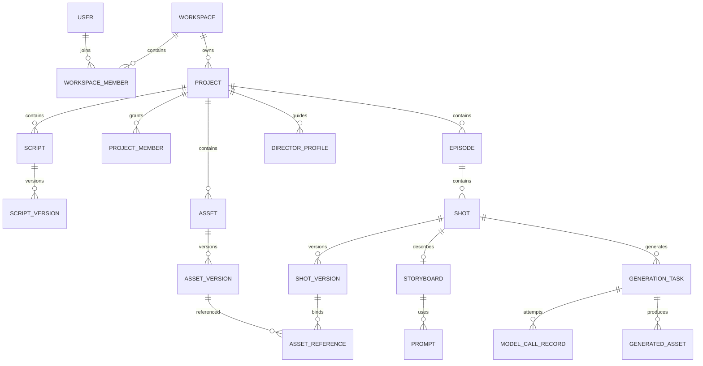
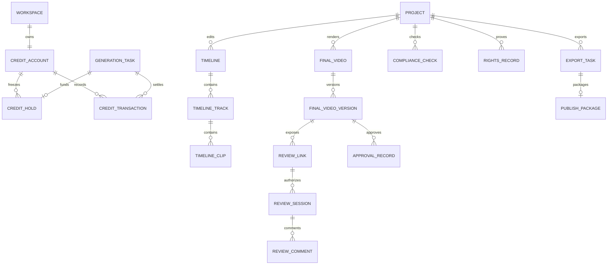
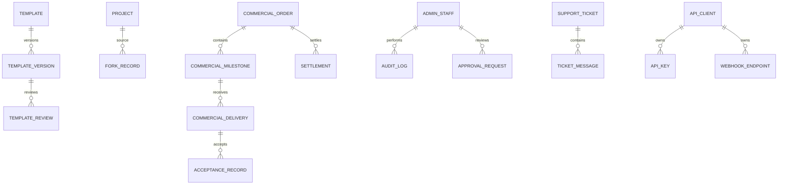

# v9.2 领域模型与 ERD

## 1. 建模原则

- 工作区是 SaaS 租户边界；绝大多数生产数据必须携带 `workspace_id`。
- 项目是生产聚合根，剧集、剧本、资产、镜头、故事板、任务和交付物通过 `project_id` 关联。
- “当前版本”使用显式引用，历史版本不可覆盖。
- 任务、模型调用、账务、审计、合规和正式导出记录追加写，不允许普通业务删除。
- 媒体二进制不进入 PostgreSQL；数据库保存对象键、摘要和媒体元数据。
- 业务主键使用 UUIDv7；面向用户的单据另有可读编号。

## 2. 核心生产 ERD

## 3. 计费与交付 ERD

## 4. 平台与生态 ERD

## 5. 聚合与一致性边界

| 聚合根 | 内部实体 | 强一致操作 | 外部事件 |
|---|---|---|---|
| Workspace | member、role、seat、invitation | 加入/移除成员、分配角色、占用席位 | `workspace.member.changed` |
| Project | episode、member、status log | 创建剧集、状态推进、预算修改 | `project.status.changed` |
| Script | script version、source mapping | 创建版本、冻结当前版本 | `script.version.frozen` |
| Asset | asset version、reference | 创建版本、设为主版本、变更授权 | `asset.version.changed` |
| Shot | shot version、storyboard、prompt | 重排、编辑、冻结镜头版本 | `shot.version.changed` |
| GenerationTask | attempts、results | 创建、受理结果、确定最终状态 | `generation.task.*` |
| CreditAccount | hold、transaction | 冻结、结算、释放、调账 | `billing.transaction.posted` |
| FinalVideo | timeline、final version | 保存剪辑版本、创建成片版本 | `final.version.created` |
| ReviewLink | session、comment、approval | 验证访问、提交批注、记录审批 | `review.action.recorded` |
| ExportTask | compliance snapshot、package | 创建正式导出、完成/失败 | `export.task.*` |
| CommercialOrder | milestone、delivery、acceptance、settlement | 推进商单节点 | `commercial.status.changed` |

## 6. 关键不变量

### 工作区与权限

1. `workspace_member` 在同一工作区和用户下只有一条有效记录。
2. 最后一名工作区所有者不能被移除或降级。
3. 项目成员的数据范围不能超过其工作区成员权限。
4. 客户外链主体不是工作区成员，不得获得生产权限。

### 内容与版本

1. `current_version_id` 必须指向同一聚合根下的有效版本。
2. 冻结版本不可原地修改；变更必须创建新版本。
3. 镜头 ID 稳定，`sequence_no` 可调整且在同一剧集当前视图中唯一。
4. 删除被引用资产前必须解除引用或创建替代映射。

### 任务与模型

1. 同一 `workspace_id + idempotency_key` 只能创建一个付费任务。
2. 一个任务可有多次模型调用，但只能有一个业务最终状态。
3. 供应商成功回调必须同时满足任务未终止、签名有效、供应商任务 ID 匹配。
4. 生成结果绑定内容摘要，重复结果不能重复入账。

### 计费

1. `available = total_granted - total_spent - active_holds`。
2. 账务流水借贷守恒，已过账流水不可更新或删除。
3. 一个冻结单的累计结算与释放之和不能超过冻结额。
4. 退款引用原交易，不以负数直接修改原交易。

### 合规与交付

1. 正式导出绑定冻结的 `project_version_id`。
2. 合规检查的输入摘要必须与导出项目版本摘要一致。
3. 存在 blocking 风险时正式导出不能进入 queued。
4. 客户批准绑定明确成片版本；新版本不会继承旧批准。

## 7. 删除与保留

- 用户可请求账号注销；账号标识匿名化，账务、审计、合规和交付证据按合法保留策略保存。
- 项目删除进入回收站，默认 30 天后回收非证据媒体；正式交付和争议中的媒体不得回收。
- 登录会话按到期清理；安全事件保留 180 天以上。
- 审计、账务、模型调用和正式导出记录采用只追加归档策略，具体期限由合规评审确认并配置，不在业务代码硬编码。

## 8. 并发控制

- 普通配置和编辑实体使用 `version bigint` 乐观锁。
- 镜头批量重排在同一剧集范围内加短事务锁，并提交单一版本变更。
- 账务账户行使用数据库行锁或串行化账本操作；禁止 Redis 锁作为唯一保证。
- 事件消费使用 `event_consumer_receipt(consumer_name,event_id)` 唯一约束实现幂等。
