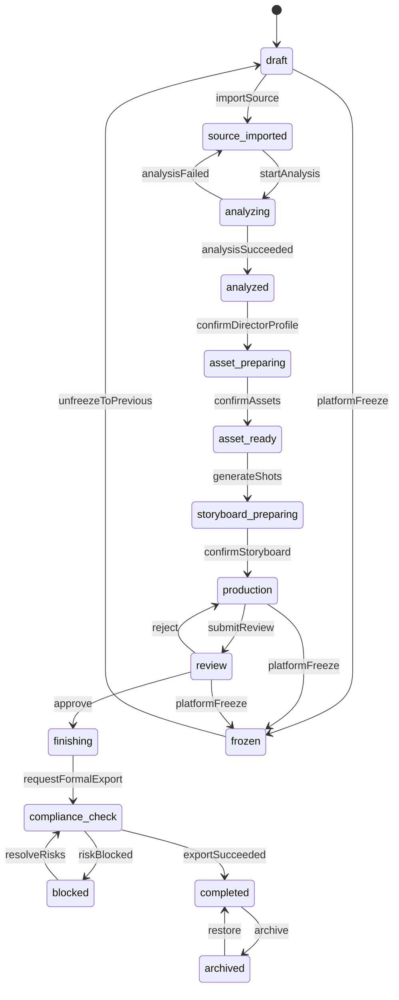
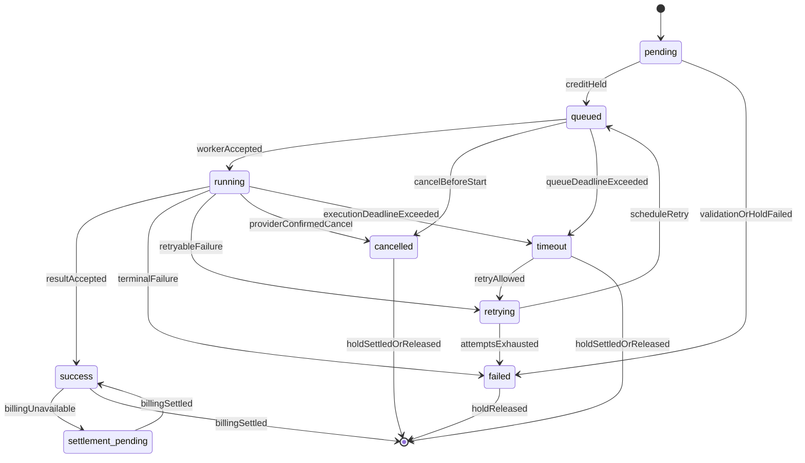
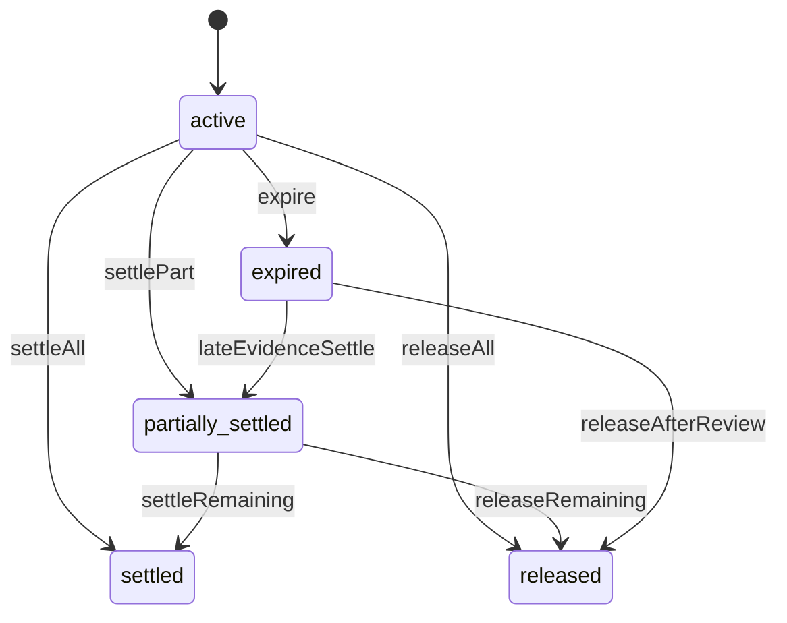
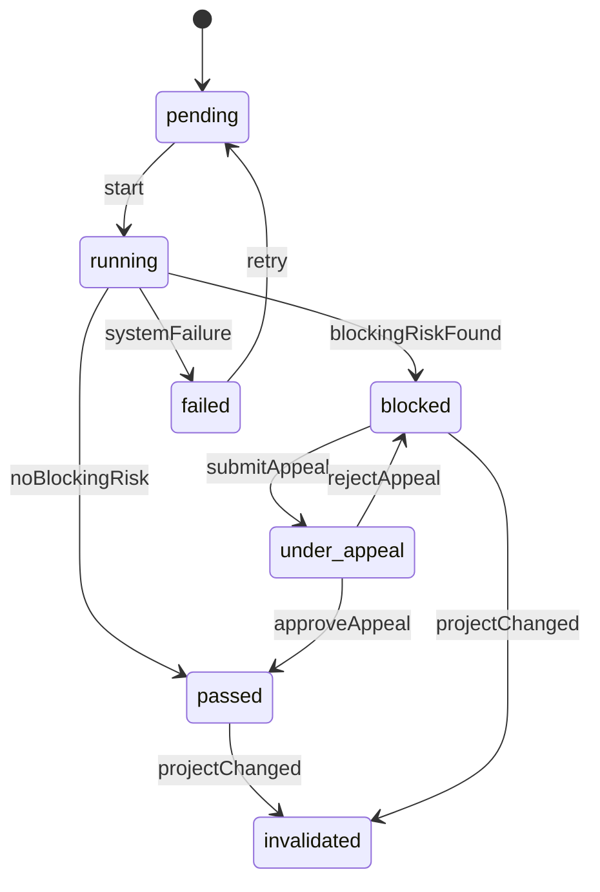
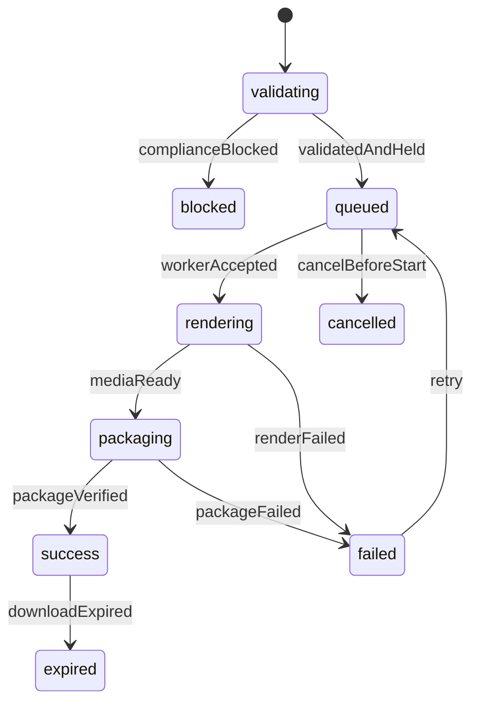
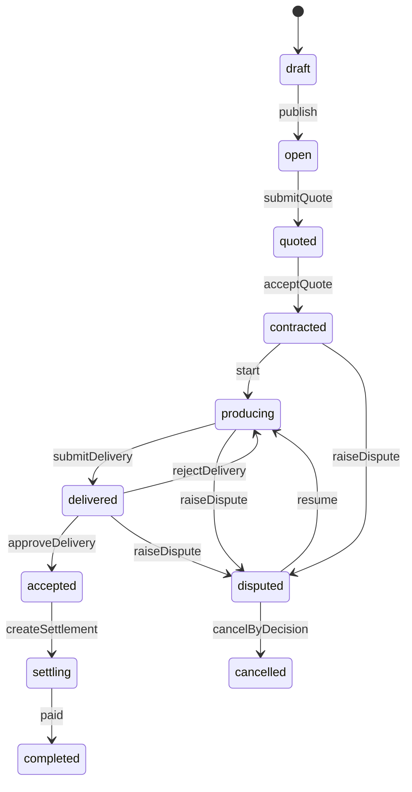

# v9.2 核心状态机

## 1. 通用规则

- 状态转换只能由拥有该聚合的服务执行。
- API 提交“动作”，服务端根据当前状态决定目标状态；客户端不能任意写 `status`。
- 每次转换记录 from、to、actor、reason、requestId、occurredAt 和业务证据。
- 重复动作在相同幂等键下返回原结果；不合法转换返回 `409 INVALID_STATE_TRANSITION`。

## 2. 项目状态机

| 动作 | 前置条件 | 原子副作用 | 失败结果 |
|---|---|---|---|
| `importSource` | 项目可编辑、有 script.import | 创建 source/script version | 文件校验失败保持 draft |
| `confirmAssets` | 必要角色/场景资产已确认 | 冻结资产引用快照 | 缺授权返回规则清单 |
| `confirmStoryboard` | 镜头质量检查无阻断 | 冻结 shot/storyboard 版本 | 冲突要求重新确认 |
| `submitReview` | 有可播放成片版本 | 创建审片批次 | 无成片返回前置错误 |
| `requestFormalExport` | 审批要求满足 | 创建项目快照和合规检查 | 有阻断项进入 blocked |
| `archive` | 无运行任务、无争议 | 项目只读、保留证据 | 返回未完成任务清单 |

## 3. 生成任务状态机

### 转换规则

| 当前 | 动作/事件 | 目标 | 规则 |
|---|---|---|---|
| pending | `credit.hold.succeeded` | queued | 任务和 hold 绑定后发布 MQ |
| queued | worker accepted | running | 记录 attempt、providerTaskId、startedAt |
| running | provider success | success/settlement_pending | 先校验媒体与摘要，再结算 |
| running | retryable failure | retrying | 错误在重试白名单且未超预算/次数 |
| retrying | retry timer | queued | attemptNo +1，可切换模型 |
| queued/running | user cancel | cancelled 或保持 running | 供应商确认前标记 cancel_requested |
| 任意非终态 | deadline exceeded | timeout | 后续晚回调进入人工/自动对账，不直接覆盖 |

终态是 success、failed、cancelled、timeout；`settlement_pending` 对用户显示“结果已生成，结算处理中”，不得进入正式导出。

## 4. 算力冻结状态机

- `settled_amount + released_amount <= requested_amount` 始终成立。
- expired 不等于免费；供应商晚回调有可信执行证据时可在审批规则内结算。
- 任何调账通过新流水完成，不修改历史流水。

## 5. 合规检查状态机

- passed 绑定 `project_snapshot_id + input_digest + rule_set_version`。
- 项目快照或权利证明变化后旧检查 invalidated。
- 人工放行必须具有 `compliance.override`、二次认证和审批记录。

## 6. 导出任务状态机

- blocked 不是失败，不冻结导出算力。
- success 前校验对象摘要、清单、AIGC 标识和合规快照。
- expired 仅使下载链接失效，不删除交付记录；有权限用户可重新生成下载链接。

## 7. 审片状态机

| 对象 | 状态 |
|---|---|
| ReviewLink | active、expired、revoked、locked |
| ReviewComment | open、acknowledged、resolved、rejected |
| Approval | pending、approved、rejected、superseded |

- 连续验证失败达到策略阈值，link 进入 locked；管理员解锁或冷却后恢复。
- 新成片版本使旧 approved 记录保持历史有效，但对新版本显示 superseded。
- 打回必须包含意见；确认交付要求再次确认版本号和交付范围。

## 8. 模板审核状态机

`draft → submitted → reviewing → approved/rejected → published → suspended/retired`。

- rejected 返回结构化问题，可从原版本派生新版本再次提交。
- published 版本不可原地修改；变更走新版本审核。
- suspended 阻止新购买/Fork，不破坏已授权项目的历史使用。

## 9. 商单状态机

- 合同、里程碑、验收和结算使用独立不可变快照。
- 争议期间暂停自动结算和超时自动确认。

## 10. 客服工单状态机

`new → assigned → investigating → waiting_user/waiting_internal → resolved → closed`，任意非 closed 状态可进入 escalated；closed 在 7 天内可 reopen。

- 补偿、退款、权限修复等动作必须关联工单 ID。
- 工单内部备注不得暴露给用户；外部回复不得包含后台敏感信息。
