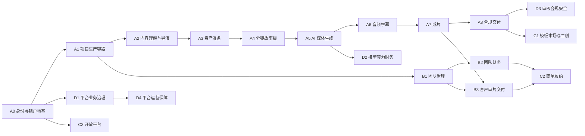

# 星镜剧创依赖关系与联合验收

> 本文件规定整块验收顺序。单个页面、单个接口或单个模块局部完成，均不能替代联合验收。

## 1. 总体依赖链

## 2. 验收包总览

| 验收包 | 组合范围 | 前置包 | 当前状态 | 通过后解锁 |
|---|---|---|---|---|
| A0 身份与租户地基 | M01 + S01 + S02 + S07 基础部分 | 无 | 开发中 | A1、B1、C3、D1 |
| A1 项目生产容器 | M02 + S03 数据/存储 | A0 | 未开始 | A2、B1 |
| A2 内容理解与导演 | M03 + S04/S05 文本能力 | A1 | 未开始 | A3 |
| A3 资产准备 | M04 + S03 版本/存储 | A2 | 未开始 | A4 |
| A4 分镜故事板 | M05 + S04 任务能力 | A3 | 未开始 | A5 |
| A5 AI 媒体生成 | M06 + S04 + S05 + S06 算力部分 + M16 P0 切片 | A4、D2 P0 | 未开始 | A6、D2 |
| A6 音频字幕 | M07 + S05 媒体处理 | A5 | 未开始 | A7 |
| A7 成片 | M08 + S03 版本 + S05 媒体处理 | A6 | 未开始 | A8、B3 |
| A8 合规交付 | M09 + S06 合规/导出 + M17 P0 切片 | A7、D3 P0 | 未开始 | P0 发布、C1 |
| B1 团队治理 | M10 + S02 | A0、A1 | 未开始 | B2、B3 |
| B2 团队财务 | M11 + S06 账务 + M16 | B1、A5 | 未开始 | C2 |
| B3 客户审片交付 | M12 + M08/M09 交付能力 | B1、A7 | 开发中 | P1 发布、C2 |
| C1 模板市场与二创 | M13 + S03/S06 授权与谱系 | A8、B1 | 未开始 | 生态发布 |
| C2 商单履约 | M14 + M11/M12 + S06 | B2、B3 | 未开始 | 商单结算 |
| C3 开放平台 | M19 + S02/S07 | A0、D4 | 未开始 | 外部集成/私有化 |
| D1 平台业务治理 | M15 + S02 审计 | A0、A1 | 未开始 | D4、P0 后台门禁 |
| D2 模型算力财务 | M16 + S04/S05/S06 | A0 | 未开始 | A5、B2 |
| D3 审核合规安全 | M17 + S02/S06/S07 | A0、A7 | 未开始 | A8 |
| D4 平台运营保障 | M18 + S01/S04/S07 | D1 | 未开始 | 各阶段运营发布 |

## 3. P0 联合验收包

### A0 身份与租户地基闭环

**范围：** 账号注册登录、令牌轮换、设备会话、工作区创建切换、多租户隔离、基础 RBAC、审计、可重复构建与部署。

**联合场景：**

1. 用户注册并登录，创建个人/团队工作区；
2. 邀请第二个用户并授予受限角色；
3. 两个工作区分别创建同名资源；
4. 使用列表、直接资源 ID、过期令牌和撤销后令牌尝试访问；
5. 检索完整审计记录并验证秘密未泄漏。

**通过条件：** 所有跨租户和越权请求被服务端拒绝；会话撤销即时生效；审计完整；Java/Python/前端/迁移/构建全绿。

### A1 项目生产容器闭环

**范围：** 项目、剧集、稳定镜头 ID、对象存储、版本、并发、归档恢复和 `project.json` 兼容。

**联合场景：** 创建项目和多集，上传源文件，生成版本，模拟并发编辑，归档并恢复，再校验数据库、对象存储和兼容投影一致。

**通过条件：** 重复请求不重复创建；版本冲突不覆盖；对象摘要一致；中断迁移可恢复；跨租户文件不可访问。

### A2 内容理解与导演闭环

**范围：** 原文管理、剧本导入、解析、内容体检、AI 改写、原文映射、AI 导演和版本冻结。

**联合场景：** 导入合法与异常源文件，解析多集，执行体检和改写，对比版本，确认导演设定并冻结上游快照。

**通过条件：** 原文到剧本映射可追溯；结构化输出校验通过；失败不破坏已保存版本；冻结结果可供资产模块消费。

### A3 资产准备闭环

**范围：** 角色、场景、道具、服装、声音等主体资产的提取、编辑、参考图、版本、授权和项目引用。

**联合场景：** 从冻结剧本提取资产，补充参考图和授权，生成多个版本，修改资产并查看影响镜头范围。

**通过条件：** 镜头引用稳定资产 ID；版本可回滚；跨项目复用受权限和授权限制；缺权利证明时阻断下游正式导出。

### A4 分镜故事板闭环

**范围：** 智能分镜、批量编辑、质量检测、镜头替换、导入导出、版本对比和故事板确认。

**联合场景：** 由剧本和资产生成分镜，批量调整顺序和参数，执行质量检测、替换、版本比较并冻结故事板。

**通过条件：** 镜头重排不改变 ID；资产引用不丢失；冲突可恢复；冻结故事板可直接创建媒体任务。

### A5 AI 媒体生成闭环

**范围：** 图片/视频生成、候选、延展、去闪、高清、重试策略、模型路由、任务状态、算力冻结与结算。

**联合场景：** 对同一镜头执行图片和视频生成，覆盖成功、供应商失败、超时、取消、重试、重复回调、批量部分失败和服务重启。

**通过条件：** 用户状态、平台任务、供应商证据、媒体版本和算力流水一致；重复事件不重复生成或扣费。

### A6 音频字幕闭环

**范围：** TTS、声音资产、配音、BGM/SFX、字幕时间轴、对口型和音轨版本。

**联合场景：** 从剧本台词生成多角色配音和字幕，混入音乐音效，执行对口型并修改时间轴后重新合成。

**通过条件：** 台词映射、时间码、音轨和视频版本一致；重新生成只影响选定范围；失败可恢复且费用正确。

### A7 成片闭环

**范围：** 时间轴预览、轻剪辑、镜头替换、版本记录、成片预览、渲染和媒体摘要。

**联合场景：** 组合图片/视频/音频/字幕，预览、修改、渲染多个版本，并在失败后恢复任务。

**通过条件：** 预览与输出一致；成片绑定不可变输入版本；渲染重试不产生重复版本或重复费用。

当前实施证据：`EV-M08-RUNTIME-MOUNT-002`、`EV-M08-FRONTEND-AUTH-003`。创作者端已通过当前会话访问明确时间线 ID 的不可变预览，并提交真实渲染任务；缺少时间线 ID 时不构造假数据。A7 仍缺时间线列表/编辑、可信媒体来源、对象存储/渲染部署、回调演练、费用和 A6 前置，保持未开始。

### A8 合规交付闭环

**范围：** 授权、内容审核、AIGC 标识、合规阻断、申诉、正式导出和下载记录。

**联合场景：** 对同一成片执行通过、阻断、申诉和项目变更失效；分别从 UI 和直接 API 尝试正式导出。

**通过条件：** 未通过合规时任何入口都无法正式导出；成功包绑定项目快照、合规结果、费用和摘要；下载过期不删除交付记录。

当前实施证据：`EV-M09-RUNTIME-001`、`EV-M09-PERSISTENCE-003`、`EV-M09-RUNTIME-HTTP-004`、`EV-M09-FRONTEND-AUTH-005`。主项目路由已接入合规证据、交付历史和非交付预检页面；无版本或目标上下文时页面停止在提示态，不发出不完整请求。A8 仍被 A7 成片、真实审核/授权/账务事实、导出执行/对象存储/下载、M17 P0 和部署验证阻塞，不能验收。

## 4. P1 联合验收包

### B1 团队治理闭环

成员邀请、角色、项目权限、席位、企业配置和团队审计作为一组验收。必须覆盖邀请过期、撤权即时生效、席位并发和跨项目权限。

### B2 团队财务闭环

团队账单、算力流水、成本总览、套餐、项目成本和发票作为一组验收。团队汇总必须能下钻到项目、任务和供应商调用证据。

### B3 客户审片交付闭环

审片链接、访问验证、播放批注、问题处理、审批、版本替换和确认交付作为一组验收。客户上下文不得获得生产编辑权限。

当前实施证据：`EV-M12-RUNTIME-HTTP-001`、`EV-M12-FRONTEND-002`。专用客户审片页面已接真实外链会话、批注、验收和交付确认 API，且无受控媒资时明确显示不可播放；仍缺 M08 成片受控媒体、M09 交付事实、真实部署及 B1/A7 前置包，故 B3 保持“开发中”，不得单页验收。

## 5. P2 联合验收包

### C1 模板市场与二创闭环

模板创建、审核、发布、市场发现、授权、Fork、谱系和停用策略一起验收；已授权历史项目不因模板停用被破坏。

### C2 商单履约闭环

商单发布、报价、合同、制作、交付、打回、验收、争议和结算一起验收；争议期间暂停自动结算。

### C3 开放平台闭环

API Key、作用域、限流、Webhook、版本兼容、审计和开发者文档一起验收；第三方不得绕过租户、计费和合规边界。

## 6. 平台治理联合验收

| 验收包 | 必验内容 |
|---|---|
| D1 平台业务治理 | 用户、项目、任务、内容查询；跨租户访问理由；高危操作审计 |
| D2 模型算力财务 | 模型配置、健康、路由、价格、冻结结算、订单、退款和对账 |
| D3 审核合规安全 | 自动/人工审核、申诉、二次认证放行、风控和不可变证据 |
| D4 平台运营保障 | 服务状态、队列、日志、告警、工单、通知、配置发布、备份恢复 |

平台后台不是独立孤岛：每个治理动作都必须在对应创作者/团队业务流程中验证实际效果。

## 7. 阶段通过规则

- P0：A0-A8 全部已验证，且 D1-D4 的 P0 切片通过；
- P1：P0 持续通过，B1-B3 全部已验证，P1 平台治理切片通过；
- P2：P0/P1 持续通过，C1-C3 全部已验证；
- 任一前置包回归失败，下游包自动降级为“待验收”或“开发中”；
- 阻断项不从总数中移除，不允许通过拆小验收包规避失败。
