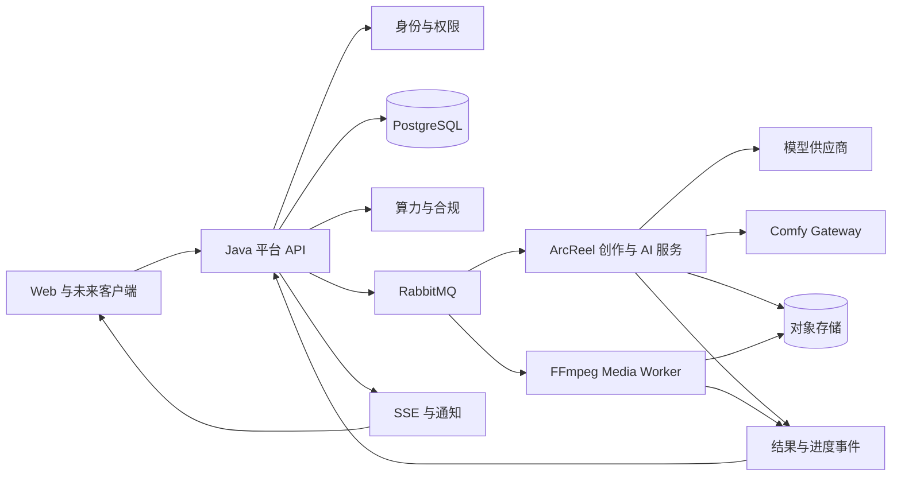

# 星镜剧创全产品交付设计

> 文档状态：已确认  
> 确认日期：2026-07-15  
> 产品基线：XJ-WEB-9.2  
> 代码基线：ArcReel `63daa73`  
> 实施分支：`xingjing/platform-main`

## 1. 最终目标

以 v9.2 原型和 `docs/v9.2-development-baseline` 为唯一产品与交互基线，在保留 ArcReel 已验证创作能力的前提下建设星镜剧创完整产品：

- 完成 P0 生产闭环、P1 团队化与交付、P2 生态与规模化全部需求；
- 覆盖 Web 创作者端、团队/企业后台、平台运营后台和客户审片端；
- 建立统一 API、身份、权限、任务、文件、通知和版本兼容体系，为 Windows、macOS、iOS、Android、HarmonyOS 后续客户端提供稳定接入边界；
- 通过需求、代码、测试、运行证据和发布门禁证明每个阶段完成，而不是以页面存在或代码写完代替验收。

最终完成条件是 P0、P1、P2 全部通过验收，197 个 v9.2 页面对应的需求均有实现与验证证据，平台基础能力支持后续多端接入，且不存在未关闭的发布阻断项。

## 2. 唯一事实源

需求冲突按以下顺序裁决：

1. `D:/aivideo/xingjing_web_full_v9_2_nav_fix` 中的 v9.2 manifest、菜单修正清单和页面；
2. `D:/aivideo/docs/v9.2-development-baseline` 中的逐页规格、数据、API、状态、权限、计费、安全、测试和部署规范；
3. `D:/aivideo/PRODUCT_REQUIREMENTS.md` 中 v9.2 未明确处的业务语义；
4. 更早 PRD、竞品研究和技术文档仅作为背景，不直接裁决实现。

ArcReel 是代码与工程能力基线，不是产品需求基线。ArcReel 的现有页面、字段和业务规则不能覆盖 v9.2 已确定的产品行为。

## 3. 已批准的总体方案

采用渐进平台化方案：从 ArcReel Git 历史创建星镜内部主仓，保留其创作工作台、AI 编排、模型适配、任务租约、SSE、版本、导出和测试体系；新增平台业务层，逐步将文件型业务真相迁移到 PostgreSQL。

不采用以下两种极端方案：

- 不在 ArcReel 单体内直接堆叠全部 197 页，因为这会放大 `project.json`、单用户假设和平台治理缺失带来的重构风险；
- 不从空仓全量重写，因为 ArcReel 已有成熟的创作、模型、任务和测试能力，直接丢弃会增加交付风险。

## 4. 目标代码结构

```text
xingjing-platform/
  apps/
    creator-web/            # 创作者 Web 工作台
    team-web/               # 团队/企业后台
    admin-web/              # 平台运营后台
    client-review-web/      # 客户审片 Web/H5
    desktop/                # Windows/macOS 后续客户端
    mobile/                 # iOS/Android 后续客户端
    harmony-app/            # HarmonyOS 后续客户端
  packages/
    api-clients/            # 按 OpenAPI 生成的多端客户端
    domain-types/           # 跨端共享的 DTO、枚举和错误语义
    design-tokens/          # 跨端设计令牌
    client-policy/          # 客户端可共享的纯规则
  platform-services/
    identity-service/       # 账号、会话、设备、API Key
    workspace-service/      # 工作区、成员、角色、席位
    project-service/        # 项目、剧集、镜头、资产和版本业务真相
    generation-service/     # 生成任务、调用记录、状态和事件
    billing-service/        # 算力冻结、结算、释放、退款和对账
    compliance-service/     # 授权、审核、风险、标识和正式导出门禁
    administration-service/ # 平台后台治理能力
  ai-services/
    creation-service/       # 从 ArcReel 迁移的创作与 AI 编排能力
    provider-adapters/      # 文本、图片、视频、音频模型适配
    comfy-gateway/          # 独立 ComfyUI 执行边界
  workers/
    media-worker/           # FFmpeg、转码、合成、导出
  contracts/
    openapi/
    events/
  infra/
  docs/
```

目录按阶段渐进形成。P0 初期允许 Java 平台能力以清晰模块边界运行在较少部署单元中，但数据库所有权、接口和事件边界必须从第一天固定，禁止通过跨模块直接写表形成新的耦合。

## 5. 服务职责

### 5.1 Java 平台业务层

Java 服务持有以下最终业务真相：

- 用户、设备会话、工作区、成员、角色与权限；
- 项目、剧集、镜头、主体资产、版本与审计元数据；
- 生成任务、任务尝试、供应商调用证据和最终业务状态；
- 算力账户、冻结、结算、释放、退款、调账与对账；
- 合规结果、授权材料、正式导出快照和平台治理记录。

Python 服务不得直接修改余额、权限、租户归属、正式导出状态或不可变审计数据。

### 5.2 ArcReel Python 创作与 AI 层

保留并演进以下 ArcReel 能力：

- 小说和剧本导入、解析、分集与结构化验证；
- AI 导演、剧本生成、角色/场景/道具资产提取；
- 分镜、宫格图、参考视频和媒体生成编排；
- 多供应商模型适配、参数归一化和费用估算；
- 任务 worker、失败归因、恢复、版本和剪映导出；
- Agent/Skill 运行时，但所有平台级操作必须调用受控平台 API。

Python 层通过版本化 API 和事件契约接收任务、报告进度并提交结果，不拥有平台最终业务状态。

### 5.3 基础设施

- PostgreSQL：平台业务主数据库；
- RabbitMQ：异步任务与领域事件；
- Redis：短期缓存、限流和分布式协调，不作为业务真相；
- 对象存储：原始素材、生成结果、预览、导出包和授权文件；
- FFmpeg worker：转码、合成、字幕、音频和正式导出；
- ComfyUI：独立 GPU 工作流执行器，通过 `comfy-gateway` 调用，不直接访问平台数据库。

## 6. 关键数据流



同步 API 只处理权限校验、数据读写、任务创建和短时操作。模型生成、转码、合成、审核和导出均通过异步任务执行。

## 7. `project.json` 渐进迁移

### 7.1 兼容阶段

- 保留 ArcReel 对现有 `project.json` 和剧集文件的读取；
- 禁止新增功能直接写文件，所有新增写入经过项目兼容网关；
- 建立数据库 ID 与旧文件项目名、剧集号、资产名的稳定映射；
- 对数据库与文件结果执行双读比对，不以双写结果直接判定成功。

### 7.2 数据库主导阶段

- 按项目、剧集、镜头、资产、版本顺序迁移；
- PostgreSQL 成为写入真相源，兼容层按需生成旧格式投影供尚未迁移的 ArcReel 代码读取；
- 每类迁移提供从零初始化、存量升级、重复执行和异常中断恢复测试；
- 数据不一致时阻断正式导出，并生成可审计修复记录。

### 7.3 文件格式降级阶段

- 运行时不再依赖 `project.json`；
- `project.json` 仅作为导入、导出和离线交换格式；
- 移除双读和兼容投影前，必须完成全量项目校验、回归测试和回滚演练。

## 8. P0、P1、P2 范围

### 8.1 P0：生产闭环

P0 覆盖 v9.2 标记的 56 个页面及其后端能力，完成：

```text
账号/工作区 → 项目 → 剧本导入与解析 → 内容体检 → AI 导演
→ 主体资产 → 分镜 → 故事板 → 图片/视频/配音字幕生成
→ 任务与模型 → 算力 → 成片 → 基础合规 → 正式导出
```

同时完成支撑闭环的最小平台后台、服务监控、审计和异常恢复能力。

### 8.2 P1：团队化与交付

P1 覆盖 121 个页面，完成团队协作、细粒度权限、席位、版本对比、对口型、客户审片、发布包、剪映/Premiere/DaVinci 交付、完整授权合规、成本财务、客服及必要运营后台。

### 8.3 P2：生态与规模化

P2 覆盖 20 个页面，完成社区、Fork、模板与资产市场、商单、开放 API、企业私有化、跨平台发布与数据回流。

P2 不得反向削弱 P0/P1 已建立的租户、权限、账务、合规和审计边界。

## 9. 多端架构边界

本轮全系统交付必须完成未来客户端所需的平台能力：

- OAuth2/OIDC 兼容身份体系、访问令牌轮换、设备会话和远程下线；
- 版本化 OpenAPI、向后兼容策略和客户端最低版本控制；
- 分片上传、断点续传、下载令牌、对象校验和离线冲突策略；
- 任务查询、SSE/推送通知、深链和分享链接；
- 统一错误码、权限提示、任务状态和设计令牌；
- 本地文件、缓存、通知、分享和安全存储通过平台适配层实现。

Web 页面不能被简单套壳视为完整桌面或移动客户端。原生客户端进入后续实施阶段，但不得要求平台核心重构。

## 10. 失败处理与业务不变量

1. 所有写操作携带请求 ID；创建任务、扣费、导出等关键操作必须携带幂等键。
2. 生成任务在调用供应商前完成算力预估和冻结，成功后按实际消耗结算，失败或取消释放未消耗冻结额。
3. 重复请求、重复消息和重复供应商回调不得重复创建任务、写入结果或结算。
4. 超时、取消、部分失败、服务重启和供应商晚回调均有明确状态与补偿路径。
5. 客户端展示状态以服务端为准，SSE/推送只用于加速刷新。
6. 所有租户数据查询必须同时校验主体、工作区和资源权限；前端隐藏不构成权限控制。
7. 正式导出绑定不可变项目版本、合规快照、费用结果和导出记录。
8. 账务、审计、模型调用证据和合规记录不可由普通用户物理删除。
9. 数据库迁移只允许版本化前向迁移；回滚通过兼容版本或前向修复完成，禁止生产环境直接回退已写入新格式的数据结构。
10. 任何未能形成可复现验证证据的功能不得标记完成。

## 11. 测试与验证

### 11.1 基线保护

- 保留 ArcReel 当前 321 个后端测试和 103 个前端测试作为迁移回归基线；
- 首次平台改造前记录测试、类型检查、lint 和构建结果；
- 现有测试失败必须分类为环境问题、既有缺陷或改造回归，并保留证据。

### 11.2 新增验证层

- 单元测试：业务规则、状态转换、权限、计费和参数映射；
- 集成测试：PostgreSQL、RabbitMQ、对象存储、Java/Python API 和事件契约；
- 迁移测试：从零、存量、重复执行、中断恢复和数据一致性；
- 安全测试：跨租户 ID、越权、文件访问、密钥脱敏和后台高危操作；
- 异步测试：重复消息、重复回调、租约过期、超时、取消、死信和补偿；
- 端到端测试：从剧本导入到正式 MP4 导出，以及团队审片和客户交付；
- 运行态验收：在目标部署拓扑中执行真实浏览器和 API 验证。

新功能采用测试先行。只有相关单元、集成、契约、端到端和发布门禁均通过时，需求状态才能进入“已验证”。

## 12. 进度计算与项目文档更新

需求状态统一为：

```text
未开始 → 开发中 → 待验收 → 已验证
```

完成度按追踪矩阵中的可验收需求计算，不按代码行数、提交数量或页面是否可打开计算。每项需求必须关联：

- 权威需求或页面编号；
- 实现提交；
- API、数据表或事件契约；
- 自动化测试；
- 必要的运行截图、日志或导出产物；
- 发布门禁结果。

总项目文档只在以下节点正式更新：

1. 项目初始化；
2. P0 全部验收完成；
3. P1 全部验收完成；
4. P2 全部验收完成；
5. 全系统最终验收完成。

小需求不反复修改总项目文档，由任务、提交、测试报告和追踪矩阵记录。用户临时查询进度时，可从当前证据生成状态报告，但不改变里程碑基线。

## 13. 发布门禁

每个 P 级必须同时满足：

- 范围内需求全部为“已验证”；
- 前后端 lint、类型检查、单元测试、集成测试和构建通过；
- OpenAPI 与事件契约兼容性检查通过；
- 数据库迁移、备份、恢复和升级演练通过；
- 多租户隔离、计费守恒、正式导出合规门禁通过；
- 关键性能、队列积压、供应商失败和服务恢复场景通过；
- 部署、监控、告警和回滚/前向修复方案可执行；
- 需求追踪矩阵不存在缺失证据或未关闭阻断项。

模型供应商合同、支付通道、内容审核评测、法务意见和生产云资源属于商用外部门禁。它们不阻塞使用 mock、沙箱和测试环境开发，但未满足时禁止真实收费、真实用户付费模型调用或商用正式发布。

## 14. 实施顺序

1. 建立代码与测试基线，冻结 ArcReel 可保留能力；
2. 建立星镜主仓目录、契约、CI 和开发环境；
3. 完成身份、工作区、多租户、RBAC、审计和对象存储；
4. 完成任务、事件、模型适配、计费和合规核心；
5. 渐进迁移项目数据并完成 P0 生产闭环；
6. 完成 P1 团队化、客户交付和运营治理；
7. 完成 P2 生态、开放能力和规模化；
8. 执行全系统最终验收并冻结最终交付基线。

每个阶段必须产生可运行软件和验证证据，不能以文档完成替代代码交付。

## 15. 设计完成标准

本设计已经明确最终目标、唯一事实源、代码组织、服务所有权、数据流、迁移路径、阶段范围、多端边界、失败规则、测试策略、进度规则和发布门禁。后续实施计划不得改变这些已确认决策；如需改变，必须记录变更原因、影响范围、迁移策略和重新验收范围。
